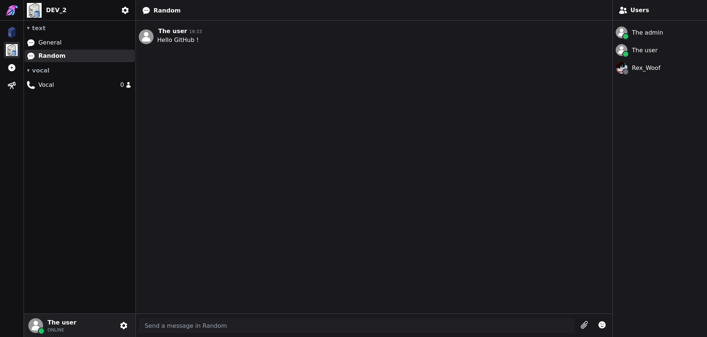

<h1 style="font-size:64px;">RevoiceChat</h1>

[](../LICENSE)
[](https://github.com/revoicechat/revoicechat)
[](https://github.com/revoicechat)

> **Take back control of your communications. No tracking, no limits, no subscription.**

RevoiceChat is an open-source and self-hosted platform for instant messaging, VoIP, and social connection. A privacy-focused communication platform that you own and control.



---

## 🎯 Why RevoiceChat?

**Full Control & Privacy**  
Host your own instance, keep your data on your servers, and maintain complete control over your communication infrastructure.

**No Vendor Lock-in**  
Own your platform. No monthly fees, no arbitrary limits, no forced upgrades, no risk of service shutdown.

**Open Source & Transparent**  
Audit the code, customize features, and contribute to a project built by the community, for the community.

**Self-Hosted Freedom**  
Deploy on your own infrastructure — whether it's a local server, VPS, or private cloud.

---

## ✨ Key Features

- 💬 **Real-time Messaging** — Instant messaging with threads, reactions, and rich media support
- 📞 **Voice & Video Calls** — High-quality VoIP with individual and group calling
- 🔐 **Privacy First** — Self-hosted architecture with optional end-to-end encryption
- 📱 **Cross-Platform** — Web, desktop (Windows, macOS, Linux), and mobile apps

[//]: # (- 🌍 **International** — Multi-language support)
[//]: # (- 🏢 **Organizations & Channels** — Structured workspaces with public and private channels)
[//]: # (- 🎨 **Fully Customizable** — Extend and modify to fit your needs)
[//]: # (- 🔌 **Integrations** — Webhooks, bots, and API for custom workflows)

---

## 🚀 Quick Start

### Docker (Recommended)

```bash
# Clone the repository
git clone --recursive https://github.com/revoicechat/revoicechat.git
cd revoicechat

# init project
./scripts/init-project.sh

# build and run docker
./scripts/deploy-update.sh

# Access at http://localhost:3000/App
```

📚 **Full documentation:** https://github.com/revoicechat/revoicechat

---

[//]: # (## 📸 Screenshots)

[//]: # (TODO _[Add screenshots or GIFs of your interface here]_)

[//]: # (---)

## 🛠️ Tech Stack

- **Backend (CoreServer):** Java, Quarkus
- **Media Server:** PHP
- **Frontend (WebClient):** Vanilla JavaScript, HTML, CSS
- **Admin Dashboard:** Vanilla JavaScript, HTML, CSS
- **Desktop & Mobile:** Tauri (Rust)
- **Real-time:** WebSocket, SSE
- **Database:** PostgreSQL
- **Deployment:** Docker, Shell scripts
- **Reverse Proxy:** Nginx

---

## 📊 RevoiceChat vs. Alternatives

| Feature                  | Slack   | Discord | RevoiceChat |
|--------------------------|---------|---------|-------------|
| Self-hosted              | ❌       | ❌       | ✅           |
| Open source              | ❌       | ❌       | ✅           |
| Full data control        | ❌       | ❌       | ✅           |
| No subscription required | ❌       | Limited | ✅           |
| Voice & Video            | ✅       | ✅       | ✅           |

---

## 🗺️ Roadmap

- [x] Real-time messaging
- [x] Voice calls
- [x] Organizations & channels
- [x] Group video calls
- [ ] End-to-end encryption
- [x] Mobile applications (iOS & Android)
- [ ] Plugin system

---

## 🤝 Community & Contributing

We welcome contributions from everyone! Whether you're fixing bugs, adding features, or improving documentation.

[//]: # (- 💬 **Discord Community:** [discord.gg/revoicechat]&#40;https://discord.gg/revoicechat&#41;)
- 📖 **Contributing Guide:** [CONTRIBUTING.md](../CONTRIBUTING.md)
- 🐛 **Report Issues:** [GitHub Issues](https://github.com/revoicechat/revoicechat/issues)

[//]: # (- 📧 **Contact:** hello@revoicechat.org)

---

## 📦 Repositories

- 📄 **Main repository:** [revoicechat/revoicechat](https://github.com/revoicechat/revoicechat)
- 🌐 **Core Server:** [revoicechat/ReVoiceChat-CoreServer](https://github.com/revoicechat/ReVoiceChat-CoreServer)
- 🖼️ **Media Server:** [revoicechat/ReVoiceChat-MediaServer](https://github.com/revoicechat/ReVoiceChat-MediaServer)
- 💻 **Web Client:** [revoicechat/ReVoiceChat-WebClient](https://github.com/revoicechat/ReVoiceChat-WebClient)
- 💻 **Admin Dashboard:** [revoicechat/ReVoiceChat-AdminDashboard](https://github.com/revoicechat/ReVoiceChat-AdminDashboard)

---

## 📄 License

RevoiceChat is released under the [GPL v3.0 License](../LICENSE).

---

## ⭐ Support Us

If you find RevoiceChat useful, please consider:
- ⭐ Starring the repository
- 🐦 Sharing on social media
- 🤝 Contributing code or documentation

[//]: # (- 💰 [Sponsoring the project]&#40;https://github.com/sponsors/your-org&#41;)

---

**Built with ❤️ by the RevoiceChat community**
